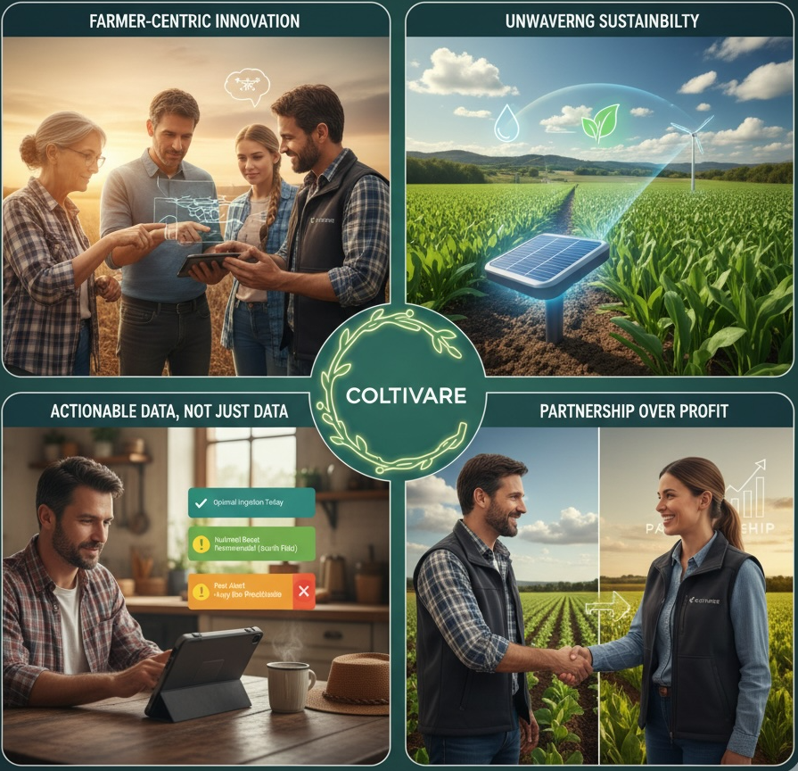

<html>

<head>
<h1> <b> Management Team</b> </h1>
</head>
 
 

<body>
<h1>  <b> The Minds Behind the Harvest: Meet the Coltivare Leadership </b>  </h1>
 
 
<h2>  <b> <u>Introduction </u> </b>  </h2>
 
 <i> At Coltivare, our strength is rooted in the passion and expertise of our team. We are a collective of agronomists, engineers, and farming advocates dedicated to one mission: empowering growers with the innovative tools and data-driven insights needed to thrive in a changing world. Meet the leaders cultivating our future. </i>
 
 

<h2>  <b> <u>Team Member 1: The Founder </u> </b>  </h2>
 
 Name:   Dr. Eleanor Vance 
 
 Title:   Founder & Chief Executive Officer 
 
  Biography: 
 
 As the founder and visionary behind Coltivare, Dr. Vance channels a lifetime of agricultural experience into the company's mission. Having grown up on a multi-generational family farm in the Midwest, she possesses an innate understanding of the challenges and rewards of cultivation. After receiving her Ph.D. in Soil Science from Cornell University, she was driven by a core belief that technology should serve the farmer, not the other way around. She founded Coltivare to bridge the gap between the lab and the land, ensuring that every solution is practical, durable, and delivers a clear return on investment. 
 
 <i> "Our roots are in the soil. We understand that farming is more than a business—it's a legacy. Our goal is to provide tools that honor that legacy while securing its future." </i> 
 
 

<h2>  <b> <u>Team Member 2: The Technology Lead </u> </b>  </h2>
 
Name:   Ben Caeter 
 
 Title:   Cief Technology Officer (CTO) 
 
  Biography: 
 
 Ben is the architect of Coltivare's innovative technology suite. With a background in data science and software engineering from MIT, he left a senior position in Silicon Valley to apply his skills to an industry he was passionate about: agriculture. Ben leads the team that builds our groundbreaking precision analytics platform, translating complex data from drones, sensors, and satellites into simple, intuitive recommendations. His work helps farmers make smarter decisions, faster. 
 
 Ben's primary focus areas are: 
 Developing AI-driven crop health monitoring to detect stress and disease before it's visible to the human eye. Integrating IoT sensors for real-time soil moisture and nutrient data, optimizing irrigation and fertilizer application. Translating complex field data into simple, actionable alerts and reports accessible via phone or tablet. 
 
 

<h2>  <b> <u>Team Member 3: The Customer Advocate </u> </b>  </h2>
 
Name:   Maria Garcia 
 
 Title:   Head of Client Relations & Field Operations 
 
  Biography: 
 
 Maria is the essential link between Coltivare's technology and the farmers we serve. Before joining our team, Maria spent 15 years managing a large-scale commercial vegetable farm in California's Central Valley, giving her unparalleled insight into the daily operational realities of modern agriculture. She is our clients' strongest advocate, responsible for everything from initial onboarding and training to gathering crucial feedback from the field. Maria ensures that our solutions are not just powerful, but also practical and easy to use for teams of any size. 
 
 <i> "My job is to make sure our technology feels like a trusted farmhand, not a complicated piece of equipment. If our clients aren't succeeding, we aren't succeeding." </i> 
 
 

<h2>  <b> <u>Our Guiding Principles </u> </b>  </h2>
 
Our work and our culture are built on four core principles: 
 

 
<ol>
  <li>  <u> Farmer-Centric Innovation:</u> We design our tools by listening to the needs of those in the field. Every feature is developed to solve a real-world challenge, ensuring practical solutions that save time and resources.  </li> 
  <li> <u> Unwavering Sustainability:</u> We are dedicated to developing technology that promotes environmental stewardship. Our products empower farmers to use water, fertilizer, and pesticides more efficiently, protecting the land for future generations. </li> 
  <li>  <u> Actionable Data, Not Just Data:</u> We believe in transforming complex information into simple, actionable insights. Our platform is designed to provide clear recommendations, not just charts and graphs.  </li> 
  <li>  <u> Partnership Over Profit:</u> Our relationship with clients doesn’t end with a sale. We see ourselves as long-term partners, providing ongoing support and evolving our technology to help them grow, season after season.  </li>
</ol>
 
 

<h3>  <b> <u>Additional Resources </u> </b>  </h3>
 
<ul>
  <li>  Dive deeper into our methodology. <a href ="file/coltivare_catalog_2025.pdf" target = "_blank"> Download our free whitepaper: 'The Future of Irrigation: Using Data to Conserve Water and Maximize Yield.’ </a> </li>
  <li> Stay informed on industry-wide trends. Learn more about sustainable farming practices at <a href ="https://www.usda.gov/topics/sustainability" target = "_blank"> the USDA's official website </a>. </li> 
</ul>
 
 

Contact Link: Have a question about this webpage? Contact us <a href = "mailto: liu4186@purdue.edu" target = "_blank"> here </a> !
 
Copyright: © 2025 Coltivare | All Rights Reserved.
 
 
 
</body>
</html>
